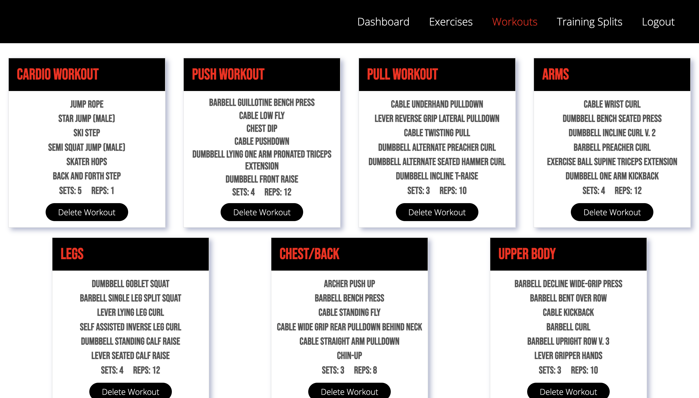

# Workout App
This full stack app allows users to view different exercises, create workouts, and create training splits with the workouts they have created. It was built using React, a JavaScript Framework, and a postgres database to hold all the users data.

## Technologies Used
- JavaScript
- React
- HTML
- CSS
- JSON Web Token
- Axios
- Express
- Sequalize
- PostgeSQL
- ExerciseDB API

## Register/Login Page

The register page allows users to create an create or login to an existing account. Users can toggle between the register and login page.

## Dashboard

On the dashboard, users can see there most recently added workout and training splits. Users can also navigate to view all their workouts or training splits from this page.

## Exercises Page

The exercises page allows users to view all the exercises and filter them by taget muscle. Users can also create a workout from this page and give that workout a name and the sets and reps for each exercise

## Workouts Page

The workouts page allows users to view the workouts they have created and delete them if they choose.

## Training Splits Page

The training splits page allows users to view the training splits they have created and delete them if they choose.

## Training Splits Form

The training splits form allows users to create a training split by giving it a name and which muscle group to workout on each day. Users can also choose from their workouts to add to each day.

